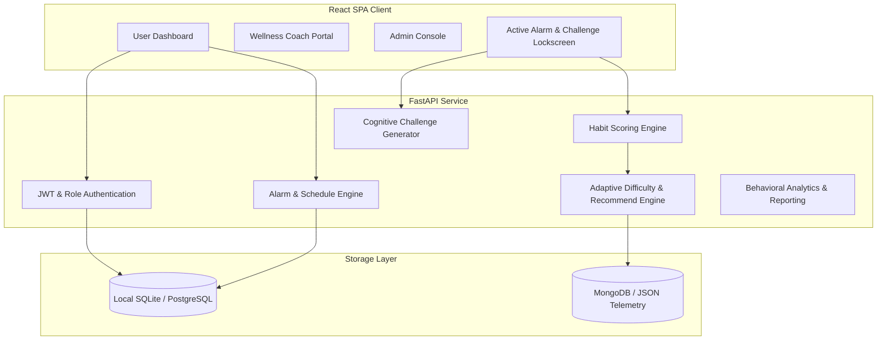

# Implementation Plan - Intelligent Cognitive Alarm Platform

Build an AI-powered Intelligent Cognitive Alarm Platform that helps users develop wake-up habits by requiring them to solve personalized cognitive puzzles to dismiss alarms.

## Proposed System Architecture

## Proposed Changes

### Component 1: FastAPI Backend (`/backend`)
A unified FastAPI backend serving REST endpoints.

#### [NEW] [database.py](file:///C:/Users/kcgop/OneDrive/Desktop/Cognitive-alarm/backend/app/database.py)
Initializes database session. Configured with SQLite by default for seamless developer setup, but shares SQL schema matching PostgreSQL targets.

#### [NEW] [models.py](file:///C:/Users/kcgop/OneDrive/Desktop/Cognitive-alarm/backend/app/models.py)
SQLAlchemy models including:
- `User` (ID, email, hashed_password, role: user/coach/admin)
- `UserProfile` (Preferred wake-up time, sleep duration, time zone, difficulty, habit preferences)
- `Alarm` (Time, recurrence: daily/weekday/weekend/one-time/smart, sound/label)
- `ChallengeLog` (Type, generated, completed at, solve time, snooze clicks, feedback difficulty)
- `HabitScoreLog` (User ID, date, score details: consistency, accuracy, snoozes, sleep adherence)
- `WellnessCoachMapping` (Coach ID, User ID)

#### [NEW] [schemas.py](file:///C:/Users/kcgop/OneDrive/Desktop/Cognitive-alarm/backend/app/schemas.py)
Pydantic validation schemas for all inputs and API responses.

#### [NEW] [auth.py](file:///C:/Users/kcgop/OneDrive/Desktop/Cognitive-alarm/backend/app/auth.py)
JWT registration, login, and authorization validation (checks role scopes like Admin and Wellness Coach).

#### [NEW] [challenges.py](file:///C:/Users/kcgop/OneDrive/Desktop/Cognitive-alarm/backend/app/challenges.py)
Challenge generator factory. Dynamically creates questions based on difficulty (Beginner, Easy, Medium, Hard, Expert):
- **Math**: Dynamic arithmetic, algebra, equations, or mental math
- **Logic**: Symbol puzzles, logic grids
- **Memory**: Sequential pattern repeat quizzes
- **Word Games**: Anagrams, reverse spelling, word association
- **Pattern Recognition**: Finding the odd element, grid symmetry matching
- **Riddles**: Predefined verbal riddle vault with fuzzy semantic matching

#### [NEW] [scoring.py](file:///C:/Users/kcgop/OneDrive/Desktop/Cognitive-alarm/backend/app/scoring.py)
Calculates and logs daily habit scores using the following weighted system:
$$\text{Habit Score} = 0.35 \times \text{Wake-Up Consistency} + 0.25 \times \text{Challenge Success} + 0.20 \times \text{Snooze Reduction} + 0.20 \times \text{Sleep Adherence}$$

#### [NEW] [difficulty.py](file:///C:/Users/kcgop/OneDrive/Desktop/Cognitive-alarm/backend/app/difficulty.py)
Heuristic and ML-based feedback loop (e.g. tracking sliding solve time and snooze rate parameters) to dynamically bump user difficulty up or down.

#### [NEW] [recommendations.py](file:///C:/Users/kcgop/OneDrive/Desktop/Cognitive-alarm/backend/app/recommendations.py)
Machine Learning rule-bases (e.g., using `scikit-learn` dummy models or light trees assessing consistency vectors) to output sleep schedule adjustments.

#### [NEW] [main.py](file:///C:/Users/kcgop/OneDrive/Desktop/Cognitive-alarm/backend/app/main.py)
Configures routing, endpoints, CORS middleware, and starting script.

---

### Component 2: Frontend (`/frontend`)
Single Page React Application configured using Vite.

#### [NEW] [Dashboard Layout]
- Left navigation sidebar.
- Sleep statistics view (using simple charts/tables displaying metrics).
- Smart Alarms planner with toggle capability.
- Sleep habit scoring trends widget.

#### [NEW] [Alarm Simulation & Challenge Lock]
- Floating alarm overlay. When active, it takes over screen, plays selectable alert tones, and blocks dismissal until the user inputs correct solutions to generated puzzles.
- Anti-snooze workflow: Snoozing increases next challenge difficulty level and penalizes habit scores.

#### [NEW] [Coach & Admin Views]
- Coaches get lists of users, tracking their consistency, assigning targets.
- Admins get full user database list, analytics on platform usage, and error reports.

---

## Verification Plan

### Automated Tests
- Build python test suite utilizing Pymock & TestClient for:
  - Auth token issuance and role guard validation
  - Correct calculation of the weighted Habit Score formula
  - Dynamic math/logic puzzle validation
- Execute backend tests: `pytest backend/tests/`

### Manual Verification
- Deploy FastAPI backend local server, test using browser Swagger UI to verify all REST endpoints.
- Boot up Vite dev server. Open browser to verify UI interactions: login/registration, creating alarm schedules, triggering active alarm simulation, and successfully unlocking it with cognitive challenges.
